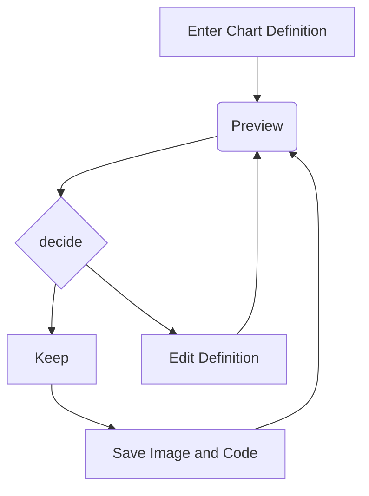

# Data Structures Tutorial

Welcome to the Python Fundamentals Tutorial.  Every beginning Python programmer should understand these basic topics:

- [Queues](1-queue.md)
- [Linked Lists](2-linked_list.md)
- [Trees](3-tree.md)

