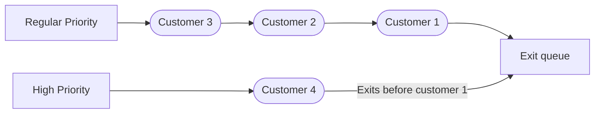

# Queues

## Queue Types

### Standard Queue

```mermaid
graph LR;

    enter[Enter queue] --> C([Customer 3]) --> B([Customer 2]) --> A([Customer 1]) --> exit[Exit queue]; 
```

### Priority Queue

```mermaid
graph LR;;

    regular[Regular Priority] --> C([Customer 3]) --> B([Customer 2]) --> A([Customer 1]) --> exit[Exit queue];

    high[High Priority] ---> D([Customer 4]) --Exits before customer 1---> exit;
```