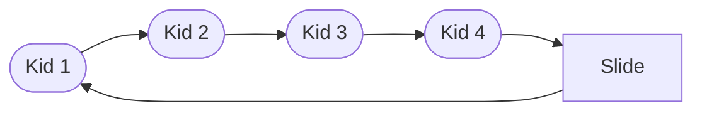

# Queues

In terms of programming a queue is a list of data that exits or runs in the order in which it entered the queue. A queue is also used in daily life in determining who may recieve service next.

## Queue Types

The Following are the various types of queues that will be covered in this tutorial

- [Standard Queue](#standard-queue)
- [Circular Queue](#circular-queue)
- [Priority Queue](#priority-queue)

### Standard Queue

A standard Queue follows the structure of first in first out or FIFO. This means that the first person to enter a line at the grocery store will also be the first one to be helped.


Every queue created will have a class to create a queue.
With the class created, a simple queue will have the following methods:
* init
* Add Queue
* Remove From Queue

```python
class Queue:
    
    def __init__(self):
        self.queue = []
        
    def add_queue(self, value):
        self.queue.append(value)

    def exit_queue(self):
        print("Removed " + self.queue.pop(0) + "from queue")
        
    def is_empty(self):
        if self.queue == 0:
            return True

```
### Circular Queue



### Priority Queue


## Example


## Try It Yourself
