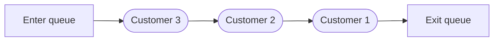

# Queues

In terms of programming a queue is a list of data that exits or runs in the order in which it entered the queue. A queue is also used in daily life in determining who may recieve service next.  

## Queue Types

The Following are the various types of queues that will be covered in this tutorial

* 
Standard Queue

* 
Circular Queue

* 
Priority Queue

### Standard Queue

### Circular Queue

### Priority Queue
