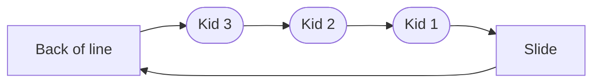

# Queues

In terms of programming a queue is a list of data that exits or runs in the order in which it entered the queue. A queue is also used in daily life in determining who may recieve service next.

## Queue Types

The Following are the various types of queues that will be covered in this tutorial

- [Standard Queue](#standard-queue)
- [Circular Queue](#circular-queue)
- [Priority Queue](#priority-queue)

### Standard Queue

A standard Queue follows the structure of first in first out or FIFO. This means that the first person to enter a line at the grocery store will also be the first one to be helped.


Every queue created will have a class to create a queue.
With the class created, a simple queue will have the following methods:
* init
* Add Queue
* Remove From Queue

```python
class Queue:
    
    def __init__(self):
        self.queue = []
        
    def add_queue(self, value):
        self.queue.append(value)

    def exit_queue(self):
        value = self.queue[0]
        del self.queue[0]
        return value
    
    def is_empty(self):
        if self.queue == 0:
            return True

```

With this class we can now create a simple program using the above class. For this class, cars are created and added to the queue.

```python
class DriveThrough:
    # Creates queue
    drive_through = Queue()

    #adds to queue
    drive_through.add_queue("Car 1")
    drive_through.add_queue("Car 2")
    drive_through.add_queue("Car 3")
    drive_through.add_queue("Car 4")

    #Exits queue
    drive_through.exit_queue()

    # Print queue
    print("\nRemaining cars in queue")
    for i in drive_through.queue:
        print(i)
    
    #Results
    # Removed Car 1 from queue

    # Remaining cars in queue
    # Car 2
    # Car 3
    # Car 4
```

### Circular Queue

A circular queue is as the diagram below shows. An example of a circular queue is like kids waiting to go down a slide. When there is a line for the slide the one in front goes down, when they reach the bottom of the slide, they get go to the back of  line to go down the slide again.



To create this circular cue we need to use the queue class above. we need to create a class Kid to store  how many times each kid wants to go down the slide. The class will look as follows.

```python
class CircularQueue:
    #creates an instance of kid
    class Kid:
        
        def __init__(self, name, turns):
            self.name = name
            self.turns = turns
    
    def __init__(self):
        self.kids = Queue()
        
    def add_kid(self, name, turns):       
        kid = CircularQueue.Kid(name,turns)
        self.kids.add_queue(kid)

    def slide_down(self):
        if self.kids.is_empty():
            print("nobody is in line")
        else:
            kid = self.kids.exit_queue()            
            if kid.turns > 0:
                kid.turns -= 1
                self.kids.add_queue(kid)
                print(kid.name + " went to back of the line")
```

### Priority Queue
The purpose of a priority queue is to grant a person special privlages to move to the front of the line if they have priority. For this you would create a class that that creates an instance that would hold the value and the priority.


## Try It Yourself
Johnson's Carwash has two lines, the first is a members only line and the other is for standard users. The members only line is catered to first and will go ahead of any of the standard users.Using the above diagram create a program that creates a priority queue for Johnson's Carwash!

* hint: You will need to iterate through the list of cars and find the cars that have priority and save that index to put them ahead of the others.

```python
#use this to check your program
carWashQueue = Johnsons()
print("\nWashed order\n")
carWashQueue.add_car("Car1",1)
carWashQueue.add_car("Car2",0)
carWashQueue.add_car("Car3",0)
carWashQueue.add_car("Car4",1)
carWashQueue.add_car("Car5",0)
carWashQueue.add_car("Car6",0)

while len(carWashQueue.cars_line.queue) > 0:
    carWashQueue.washed()
#This should print the following order of cars
#Car1,Car4,Car2,Car3,Car5,Car6
```
__[Show Answers](./queue_answers.py)__


