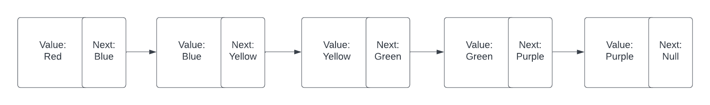
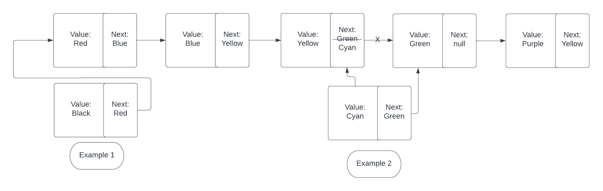
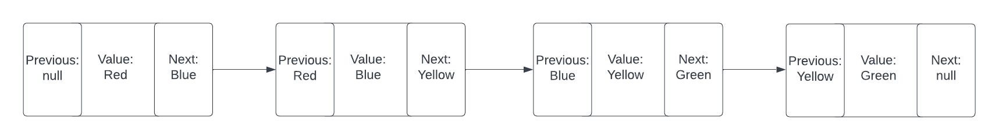
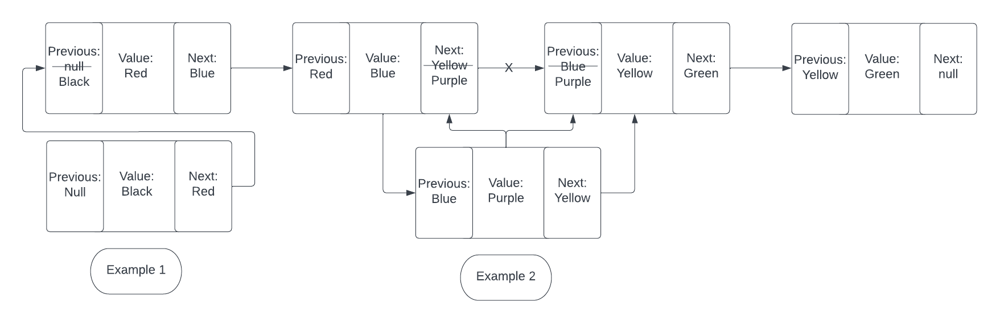

# **Linked Lists**

A linked list is a linear data structure much like an array. A linked list consists of the node's value and the next node's value. This is how they are linked together. It is much like the old game snake where the snake gets longer in the back. In other words, it adds new values to the beginning and pushes everything else back.

So why use a linked list over an array if they are similar? It mostly has to do with the efficiency of the program. With an array, if you had 500 values in an array, but you wanted to insert a value in the middle of it, it would have to shift everything from the middle over. The same is said if you were to delete a value from an array, every item would have to shift the index down a number. With a linked list deleting takes the next nodes number and changes the previous "next" to that number. this is 2 simple changes rather than 250 changes.

## **Types of linked list**

- [Single Linear](#single-linear-linked-list)
- [Double Linear](#double-linear-linked-list)
- [Example](#example)
- [Try It Yourself](#try-it-yourself)

### **Single Linear Linked List**

Each node in single linked list consists of two values:

- Node value
- Next value

The node value consists of the data you want to store, and the next value is what links that node to the next node. The next value equals the node value of the next node. A simple illustration is given below. 

|  | 
|:--:| 
| *linked list figure 1* |

#### **Adding node to a the front of a single linked list**

A linked list has a head, and a tail. The head is the node that is the furthest to the right and the tail is the furthest to the left.
When adding to the head, the new node becomes the new head and the old head becomes part of the tail. To add to the head you would simply create a new node that has the next value of the old head.

* [See Example 1 Figure 2](add_single_linked_list.png)

#### **Adding into the middle of a single linked list**
To add a node into the middle of the linked list, you will need to find the two nodes that you would like to put them in between. In the picture below it shows that we are putting a node value of "Cyan" in between "Yellow" and "Green". We need to create the new node of "Cyan" with a next value of "Green", and then we need to change the next value of "Yellow" to "Cyan". This will create a new node that satisfies the requirement.  

* [See Example 2 Figure 2](add_single_linked_list.png)

|  | 
|:--:| 
| *linked list figure 2* |

### **Double Linear Linked List**

Each node in Double linked list consists of three values:

- Previous value
- Node value
- Next value

Much like a Single linked list, a double linked list contains a "Node value" and a "Next Value". The difference is that we are now adding a "Previous Value" to the node. An example of how this might look is listed in the picture below.

There are a both advantages and disadvantages to using a double linked list versus a single linked list. The main benefit of a double linked list is that because you have a "Previous Value" and a "Next Value", you can traverse the linked list from either direction. With a single linked list you can only traverse in one direction. This can make a double linked list more efficient in the long run. The down side to the double linked list is that because we are storing an extra value per node, it can occupy more memory.

|  | 
|:--:| 
| *linked list figure 3* |

#### **Adding node to a the front of a double linked list**

Adding a node to the head(front) consists of creating the new node making the "Next Value" of the new node to the value of the old head node. You then will make the old head's "Previous Value" to be the new nodes value. This will successfully insert a new node into the front.
* [See Example 1 Figure 4](add_double_linked_list.png)

#### **Adding node to a the middle of a double linked list**

Adding a node to the middle of a double linked list is similar to adding a node into the middle of the single linked list. The difference is you now have to sever where you want to insert it and change the values accordingly. In the picture below we are adding the value "Purple" in between "Blue" and "Yellow". we first create the new node and create the "Previous Value" to be "Blue" and the "Next Value" to be "Yellow". We then need to make Blue's "Next Value" to be Purple, and Yellow's "Previous Value" to be "Purple". 

|  | 
|:--:| 
| *linked list figure 4* |

## Example
[Access the file here](./linked_list_write.py)
```python
class SingleLinkedList:
    #Creates a new node
    class node:
        def __init__(self, value):
            self.value = value
            self.next = None
            
    def __init__(self):
        self.head = None

    def insert(self, value):
        new_node = SingleLinkedList.node(value)
        if self.head is None:
            self.head = new_node
        else:
            current_node = self.head
            while current_node.next is not None:
                current_node = current_node.next
            current_node.next = new_node
            
    def insertIntoAfter(self, insertAfter, new_value):
        current_node = self.head
        
        while current_node is not None:
            if current_node.value == insertAfter:
                new_node = SingleLinkedList.node(new_value)
                new_node.next = current_node.next
                current_node.next = new_node
                return 
                
            current_node = current_node.next
                
    def search(self, value):
        current_node = self.head
        while current_node is not None:
            if value == current_node.value:
                return True
            else:
                current_node = current_node.next
        return False

    def __str__(self):
        node_values = []
        current_node = self.head
        string = "Linked List Values:"
        while current_node is not None:
            node_values.append(current_node)
            string += f"{current_node.value},"
            current_node = current_node.next
        return string

colors_list = SingleLinkedList()
colors_list.insert("Red")
colors_list.insert("Blue")
colors_list.insert("Yellow")
colors_list.insert("Green")
colors_list.insert("Purple")
colors_list.insertIntoAfter("Yellow","Cyan")
colors_list.insertIntoAfter("Red","Black")
print(colors_list)
#Prints "Linked List Values:Red,Black,Blue,Yellow,Cyan,Green,Purple,"
```

## Try It Yourself

Now it is your turn! use the above example and see if you can turn this into a doubly linked list. Remember that a double linked list uses a Previous as well as a next. You may have to change some values to make it work.

```python
#Use this string and test to check your results
    def __str__(self):
        node_values = []
        current_node = self.head
        string = "Linked List Values:"
        while current_node is not None:
            if current_node.previous is not None:
                prev = current_node.previous.value
            else:
                prev = None
            if current_node.next is not None:
                nex = current_node.next.value
            else:
                nex = None
            # node_values.append(current_node)
            string += f"[{prev}[{current_node.value}]{nex}],"
            current_node = current_node.next
        return string

colors_list = DoubleLinkedList()
colors_list.insert("Red")
colors_list.insert("Blue")
colors_list.insert("Yellow")
colors_list.insert("Green")
colors_list.insert("Purple")
colors_list.insertIntoAfter("Yellow","Cyan")
colors_list.insertIntoAfter("Red","Black")
print(colors_list)

#Solution will look like this:
#Linked List Values:[None[Purple]Green],[Purple[Green]Yellow],[Green[Yellow]Cyan],[Yellow[Cyan]Blue],[Yellow[Blue]Red],[Blue[Red]Black],[Red[Black]None],
```

[Solution](./linked_list_solution.py)
